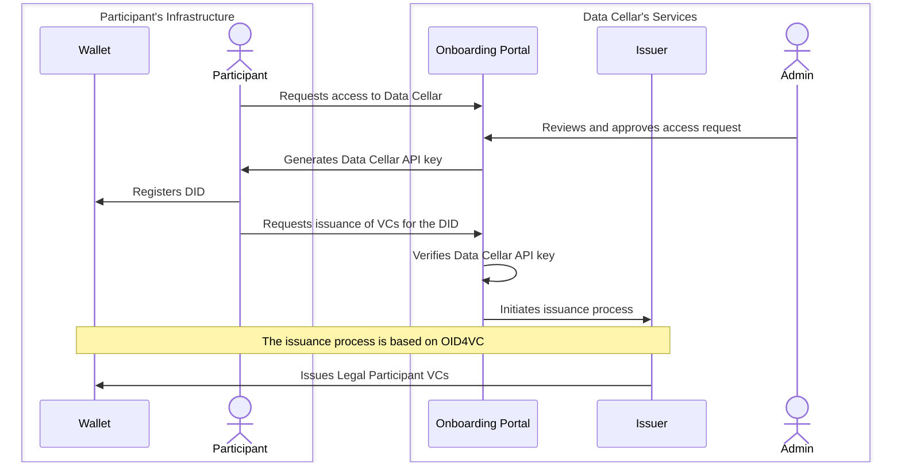

# Data Cellar Participant Template

- [Data Cellar Participant Template](#data-cellar-participant-template)
  - [Project Structure](#project-structure)
  - [Prerequisites](#prerequisites)
    - [Obtain an API Key](#obtain-an-api-key)
  - [User Guide](#user-guide)
    - [Start the Proxy and Initialize a Participant](#start-the-proxy-and-initialize-a-participant)
    - [Deploy the Participant](#deploy-the-participant)
      - [Customize the Configuration](#customize-the-configuration)
      - [Start the Participant Services](#start-the-participant-services)
      - [Run an Example to Test the Connector](#run-an-example-to-test-the-connector)
  - [Other Tasks and Notes](#other-tasks-and-notes)
    - [Access to the Credentials Manager API](#access-to-the-credentials-manager-api)
    - [Register a Legal Participant in the Global Catalogue](#register-a-legal-participant-in-the-global-catalogue)
  - [Next Steps](#next-steps)
    - [Testing Against the Public Test Connector](#testing-against-the-public-test-connector)
  - [License](#license)

This repository contains all the essential components needed to set up a Data Cellar participant. It includes a web server for hosting verifiable credentials, a participant wallet, the Data Cellar data space connector (based on the EDC connector codebase), and the Data Cellar CDE.

> [!CAUTION]
> This repository is in an early stage of development. The codebase is not stable and the interfaces are subject to change. Some features are half-implemented.

## Project Structure

The `participant-template` directory contains all the necessary modules to create a participant. The configuration for all components emanates from the `.env.tmpl` file, which is a dotenv file containing several environment variable declarations. The values of these environment variables are defined during the setup process and are then substituted to create the definitive `.env` file.

The `deploy` directory mainly contains the script used to create a participant: an interactive script that prompts the user for the necessary information and then configures the environment. The result is a new participant directory containing the definitive `.env` file and the complete set of services to host a participant.

## Prerequisites

To deploy a participant, you need to have the following prerequisites:

- [Docker](https://docs.docker.com/)
- [Taskfile](https://taskfile.dev/)
- A reasonably modern Linux distribution
- A public DNS domain name that points to your server, with ports 80 and 443 open and accessible

> [!IMPORTANT]
> Your DNS must be configured for both the domain name and the subdomain that includes the participant name. For example, if your DNS domain is `datacellar.cosypoc.ovh` and your participant name is `consumer`, your DNS must be configured for both `datacellar.cosypoc.ovh` and `consumer.datacellar.cosypoc.ovh`.

There are scripts for your convenience in the `install` directory to help you install these prerequisites. In any case, it is recommended that you follow the official documentation for these tools.

### Obtain an API Key

Moreover, you must complete the initial steps of the onboarding process to obtain an API key, which is required to communicate with the Data Cellar Issuer and obtain the necessary Verifiable Credentials. The sequence diagram below illustrates the onboarding process. Note that most of these steps are automated by this repository.



The **web page of the onboarding portal** is available at:

https://idp.datacellar.cosypoc.ovh

However, please note that the onboarding portal is a work in progress. If you encounter any issues, or if the portal is unavailable, please contact the Data Cellar team.

## User Guide

### Start the Proxy and Initialize a Participant

The Data Cellar Participant Template uses Caddy as a reverse proxy to manage the various APIs and HTTP services exposed by its components. Before proceeding with deployment, ensure Caddy is running by navigating to the `deploy` directory and executing the following command:

```
task start-proxy
```

When the task completes, you should be able to verify that a new container named `datacellar.caddy` is running.

> [!IMPORTANT]
> The proxy is shared by all participants - only one proxy container should be running at a time.

Then you should run the task that will prompt you for the necessary information to configure a new participant:

```
task setup-participant
```

During setup, you'll need to provide several configuration details. The following list offers clarification on some of these parameters:

- The **DNS domain name** of your server - This must be a public domain name so Caddy can automatically obtain HTTPS certificates through Let's Encrypt.
- The **participant name** - A unique identifier that will be combined with your DNS domain to create the participant's full domain name.
- The **Issuer API key** - A secret key given to you during onboarding that allows your participant to authenticate with Data Cellar's identity services and obtain verifiable credentials for data space access.
- The **Issuer DID** - The Decentralized Identifier of Data Cellar's central issuer, which acts as the trust anchor and issues verifiable credentials for all participants.
- The **Data Cellar API URLs** - The endpoints your participant will use to interact with Data Cellar's identity services.
- The **OpenAPI specification URL** - The URL to the OpenAPI specification that describes the HTTP API that your connector *provides* to the data space.

Unless you have a specific reason to change them, leave the default values as they are. For example, while the script offers the flexibility to modify the API URLs of the Data Cellar services, you will most likely want to keep the default URLs that connect to the production Data Cellar services.

> [!NOTE]
> If a participant folder already exists, the script will stop all services and delete the folder before creating a new one. Ensure that the folder and proxy paths you provide are correct and accessible.

### Deploy the Participant

After running the setup task, a new participant directory will be created under the `deploy/participants/<participant-name>` path. This directory contains the software services that have been customized for your configuration and need to be started to run your participant.

#### Customize the Configuration

The participant's configuration is stored in a `.env` file located at `deploy/participants/<participant-name>/.env`.

> [!WARNING]      
> You **should** review and customize some of the configuration values in this file to improve security and fit your needs. Otherwise, you'll be using the default credentials for some services, which poses a significant security risk.

The following table describes the most important environment variables you may want to customize:

| Variable                                                        | Description                                                                                                   |
| --------------------------------------------------------------- | ------------------------------------------------------------------------------------------------------------- |
| `WALLET_USER_NAME`, `WALLET_USER_EMAIL`, `WALLET_USER_PASSWORD` | Authentication credentials for accessing your local wallet                                                    |
| `KEY_PASSW`                                                     | Password for the certificate store used by the connector                                                      |
| `EDC_POSTGRES_USER`, `EDC_POSTGRES_PASSWORD`                    | Database credentials for the connector                                                                        |
| `RABBITMQ_DEFAULT_USER`, `RABBITMQ_DEFAULT_PASS`                | Authentication credentials for the RabbitMQ message broker used by the connector                              |
| `EDC_CONNECTOR_OPENAPI_URL`                                     | URL to the OpenAPI specification that describes the HTTP API that your connector *provides* to the data space |
| `EDC_CONNECTOR_API_KEY`                                         | API key secret to access the APIs of the connector                                                            |
| `SUBJECT`                                                       | Subject for the connector's certificate                                                                       |

#### Start the Participant Services

Move to the `deploy/participants/<participant-name>` directory and run the following task:

```
task start-all
```

You will be prompted to confirm whether you want to generate a Legal Participant VC. If you choose "yes", you'll need to provide the following details:

- **Legal Name** of your organization (e.g., "CEA")
- **VAT ID** (e.g., "FR43775685019")
- **Country Subdivision Code** (e.g., "FR-OCC")

> [!IMPORTANT]
> The VAT ID and Country Subdivision Code must be **valid** to successfully complete the VC issuance process.

The system will request the following VCs from the Data Cellar Issuer using the OpenID For Verifiable Credentials (OIDC4VC) protocol:

- Terms and Conditions
- Legal Registration Number 
- Legal Participant

> [!TIP]
> You can rerun this step later by executing the `credentials-manager:create-legalparticipant` task.

> [!NOTE]
> The wallet will be configured and provisioned during the startup of the participant, and a DID web document will be generated and stored in the wallet.

#### Run an Example to Test the Connector

You can test the connector by running an example that fetches the available datasets (catalogue) from your connector:

```
task connector:test-catalogue
```

You should see that the script finishes successfully and outputs the available datasets (catalogue) in the console, similar to this:

```
[...]

[{'@id': 'GET-pet-findByTags',
  '@type': 'dcat:Dataset',
  'dcat:distribution': [{'@type': 'dcat:Distribution',
                         'dcat:accessService': '7fbd5b95-d607-423c-9278-768916b60f65',
                         'dct:format': {'@id': 'HttpProxy-PUSH'}},
                        {'@type': 'dcat:Distribution',
                         'dcat:accessService': '7fbd5b95-d607-423c-9278-768916b60f65',
                         'dct:format': {'@id': 'HttpData-PULL'}},
                        {'@type': 'dcat:Distribution',
                         'dcat:accessService': '7fbd5b95-d607-423c-9278-768916b60f65',
                         'dct:format': {'@id': 'HttpData-PUSH'}}],
  'id': 'GET-pet-findByTags',
  'name': 'GET /pet/findByTags (findPetsByTags)',
  'odrl:hasPolicy': {'@id': 'Y29udHJhY3RkZWYtR0VULXBldC1maW5kQnlUYWdz:R0VULXBldC1maW5kQnlUYWdz:YjM2NDIwNWItZmFkZi00MGI2LWJhM2EtYjVhOTQ1MzhjNDQ5',
                     '@type': 'odrl:Offer',
                     'odrl:obligation': [],
                     'odrl:permission': [],
                     'odrl:prohibition': []}},

[...]
```

> [!TIP]
> If you haven't defined the URL to the OpenAPI file for the API provided by your connector, your catalogue will be empty (i.e., your connector will only act as a consumer).

## Other Tasks and Notes

### Access to the Credentials Manager API

You can use the Credentials Manager API to interact with the Data Cellar Identity Services. For example, the API allows you to:

- View all Verifiable Credentials stored in your wallet
- Sign existing Verifiable Credentials
- Verify proofs of Verifiable Credentials

The **API documentation** is available at:

```
https://<fully-qualified-participant-domain>/api/v1/docs
```

For example, if your participant is named `consumer` and your DNS domain is `datacellar.cosypoc.ovh`, the API documentation will be available at `https://consumer.datacellar.cosypoc.ovh/api/v1/docs`.

### Register a Legal Participant in the Global Catalogue

To register a legal participant in the global catalogue, run the following task:

```
task credentials-manager:register-legalparticipant-catalogue
```

You will be prompted to enter the ID or URL of the Legal Participant's Verifiable Presentation (VP), which was generated during the participant deployment process.

The catalogue registration request is sent to the Data Cellar Identity Provider, which handles the registration in the catalogue. This process was designed this way for governance and authorization reasons. The Data Cellar administrator must approve the registration of a new participant in the catalogue.

> [!NOTE]
> This feature has been implemented but is not fully connected to the global catalogue, as it is not currently deployed.

For example:

```console
$ task credentials-manager:register-legalparticipant-catalogue
task: [credentials-manager:start-api] docker compose -p consumer up credentials-api --wait
[+] Running 1/1
 ✔ Container consumer.credentials-api  Healthy                                                                                                                                   0.0s 
VP Legal Participant (url or id): https://consumer.datacellar.cosypoc.ovh/vp/bc6ca012-e5bd-46a2-99a0-76edfef0c105.json
2024-10-23 15:01:18.957 | INFO     | __main__:<module>:83 - [Participant DID] -> did:web:consumer.datacellar.cosypoc.ovh:wallet-api:registry:7051ea41-28e2-4fdb-bbf7-ad2c65aa29d9
2024-10-23 15:01:18.957 | INFO     | __main__:<module>:85 - [Global Catalogue] -> register legal participant
2024-10-23 15:01:18.957 | INFO     | __main__:<module>:86 - [LEGAL_PARTICIPANT_ID] -> https://consumer.datacellar.cosypoc.ovh/vp/bc6ca012-e5bd-46a2-99a0-76edfef0c105.json
2024-10-23 15:01:22.268 | INFO     | __main__:<module>:91 - {'status': 'success', 'message': 'All credentials verified successfully', 'details': 'registration legalParticipant into the catalogue is under-construction'}
```

## Next Steps

After the deployment, you'll have all the services required to operate in the Data Cellar data space. This means that, among other services, you'll have access to a data space connector based on the [Eclipse Dataspace Components (EDC) Connector](https://github.com/eclipse-edc/Connector) framework. You can check the specific launcher and extensions used in this connector in the [fundacionctic/connector-building-blocks](https://github.com/fundacionctic/connector-building-blocks) repository.

> [!NOTE]
> Data Cellar has developed bespoke extensions on top of the EDC Connector framework to support the specific needs of the Data Cellar data space. These extensions are necessary for an EDC connector to interoperate with the Data Cellar infrastructure.

If you have defined the URL to the OpenAPI specification of the HTTP API that is exposed by your connector to the data space (i.e., variable `EDC_CONNECTOR_OPENAPI_URL` in the `.env` file of a participant), and you do not want to consume any data from the data space, you are essentially finished. At this point, your datasets should eventually be available in the data space.

If you wish to consume data from the data space, you will need to interact with the APIs of your connector to communicate with other connectors in the data space, as illustrated in the [eclipse-edc/Samples](https://github.com/eclipse-edc/Samples) repository.

To help ease the learning curve, Data Cellar has developed a small Python package named `edcpy` that wraps the logic to interact with the APIs of your connector. You can find it [published on PyPI](https://pypi.org/project/edcpy/). The source code is [available here](https://github.com/fundacionctic/connector-building-blocks/tree/main/edcpy), and [this link](https://github.com/fundacionctic/connector-building-blocks/tree/main/example) provides examples of how to use it.

### Testing Against the Public Test Connector

There is a public test connector available at [`ctic.dcserver.cticpoc.com`](https://ctic.dcserver.cticpoc.com/api/v1/docs) that you can use to test your participant against.

More specifically, there is a task `connector:test-catalogue-remote` that fetches the catalogue from a remote connector and prints it to the console. This can be useful to verify that:

* Your participant is correctly configured
* Your wallet has been issued a valid Data Cellar Verifiable Credential
* Your connector can successfully reach the Data Cellar data space

The task can be run by executing the following command in the `deploy/participants/<participant-name>` directory:

```
REMOTE_PROTOCOL_URL=https://ctic.dcserver.cticpoc.com/protocol task connector:test-catalogue-remote
```

> [!TIP]
> You can test other connectors by replacing the hostname in the `REMOTE_PROTOCOL_URL` environment variable.

> [!NOTE]
> The API exposed by the public test connector to the data space is the sample **Pet Store Server**, available at [`petstore3.swagger.io`](https://petstore3.swagger.io/).

## License

This project is licensed under the terms outlined in the [LICENSE](LICENSE) file.
